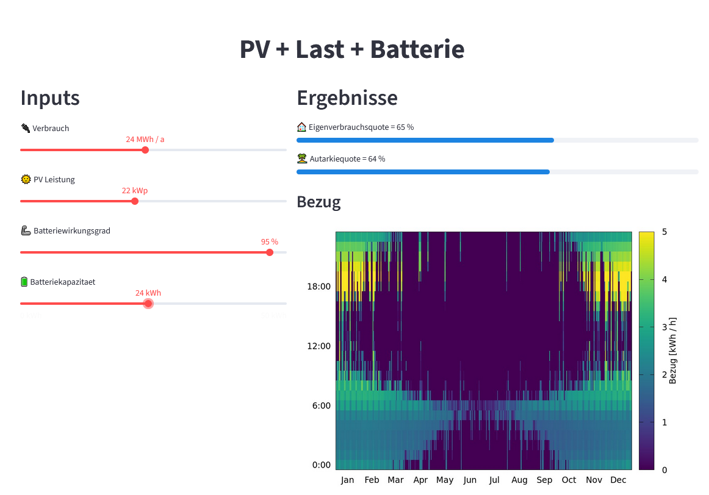

# Basic Streamlit + INSEL web app

## Usage

### Docker

Run `docker compose watch`

### uv

With Python+uv installed, run `uv run streamlit run insel_web_app.py`.

(You might need to modify the absolute paths inside templates files).